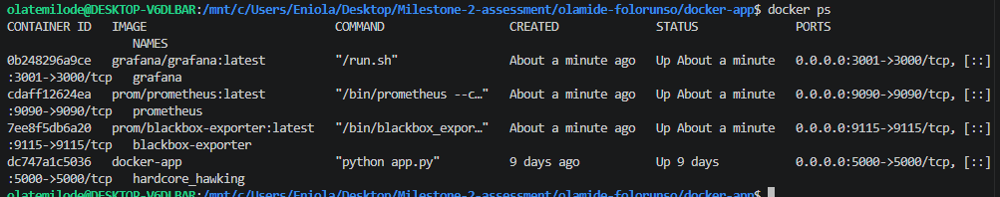

# Docker app
# Explanation of docker file instructions
# FROM
Specifies the base image to use.

# RUN
Executes commands during the image build process.

# COPY
Copies files from your local machine into the container

# CMD	
Defines the default command that runs when the container starts (e.g., python app.py). Only one CMD is active

# Docker App Monitoring
This projet sets up a monitoring stack using Docker Compose featuring Prometheus, Grafana and blackbox exporter for observability and metrics visualization.

# Running containers

